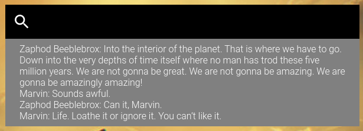
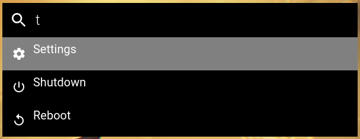
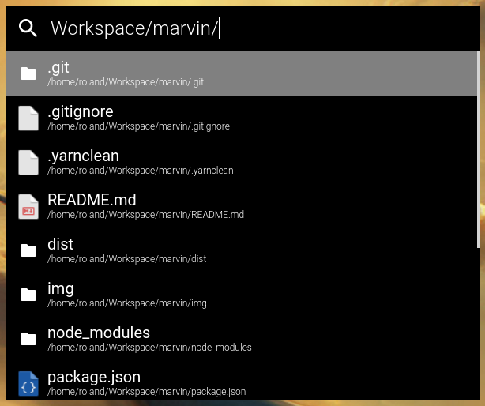
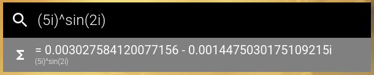
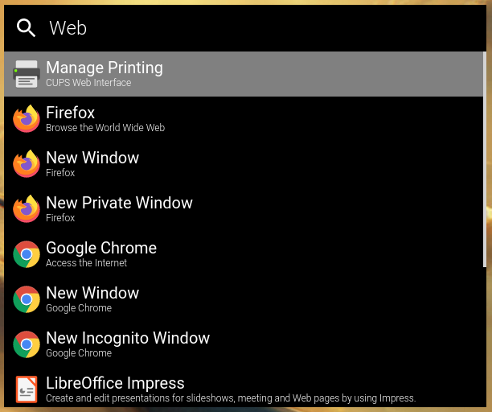

 Marvin
===
This is a keystroke launcher for Linux. It is build using electron but it has not been ported to Windows or MacOs yet.

## Instalation
At this point the only way to install this application, is to install it from source.
To do that, you can execute the following commands.
```
$ cd /tmp
$ git clone https://github.com/rolandbernard/marvin
$ cd marvin
$ yarn dist
$ sudo cp dist/Marvin-X.X.X.AppImage /usr/bin/marvin
```

## Features
With the global shortcut (Super+D by default, but can be changed) you can open the main program.
The program uses different modules to provide different functionalities.

### Modules
#### Marvin quotes
This module will show you random, inspiring and uplifting quotes from Marvin the paranoid robot.



#### Linux system
This module will give you access to some fundamental linux system operations. (Reboot, Shutdown)



#### Folders
This module allows you to browse files.



#### HTML
This module allows you to create custom HTML entries.

#### Calculator
This module allows you to do calculations using mathjs.



#### Linux applications
This module allows you to start applications on linux.



#### URL module
This module allows you to open urls.


#### Locate
This module allows you to search for files using locate.

#### Shortcuts
This module allows you to define shortcuts to run shell scripts.

