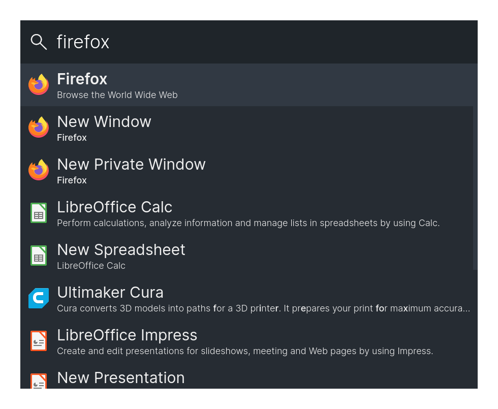
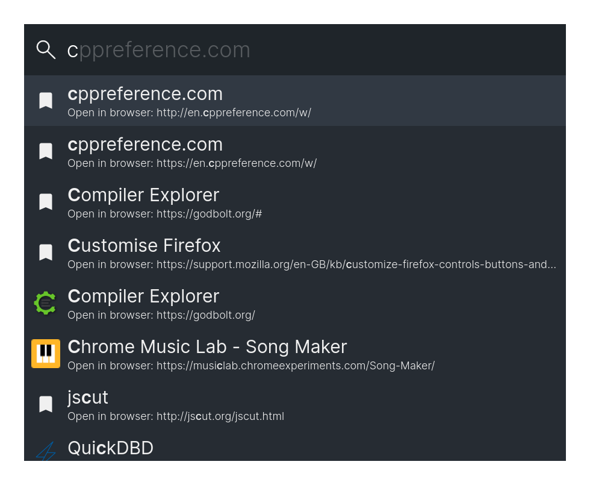
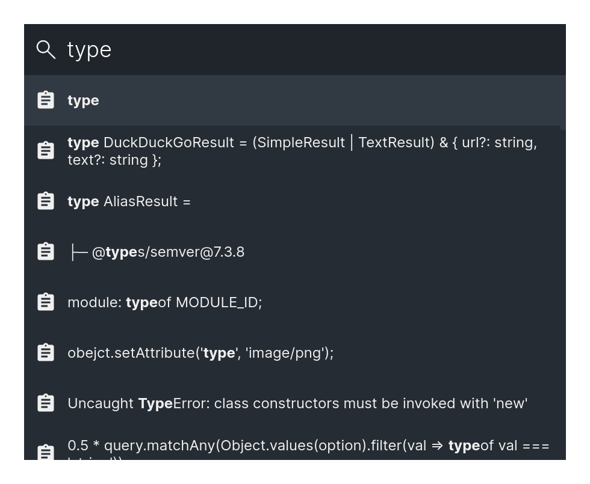
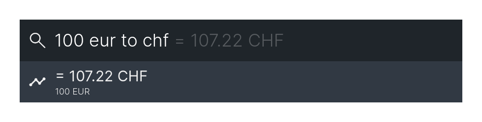
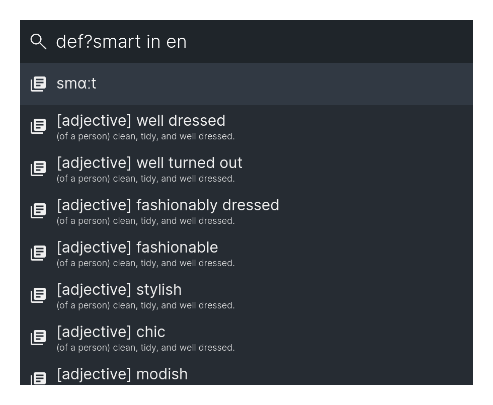
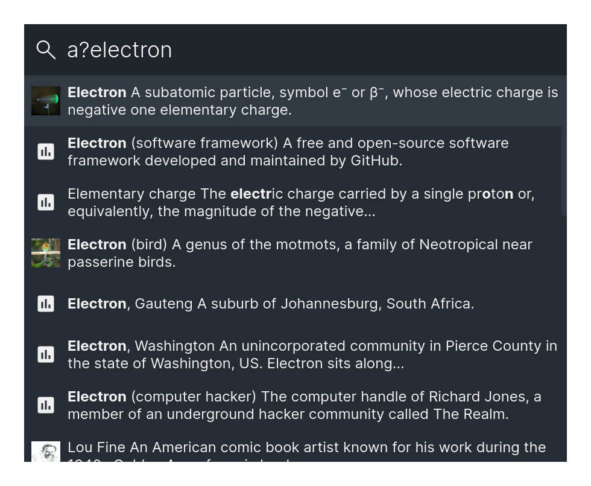
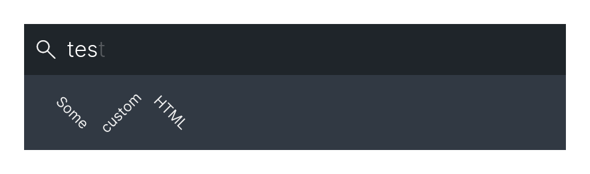
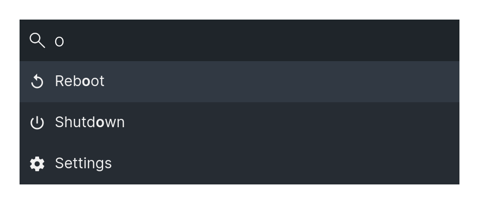
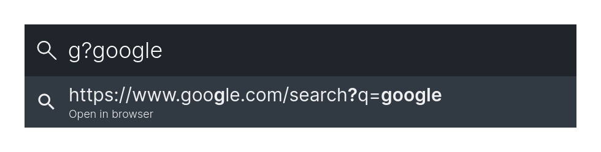
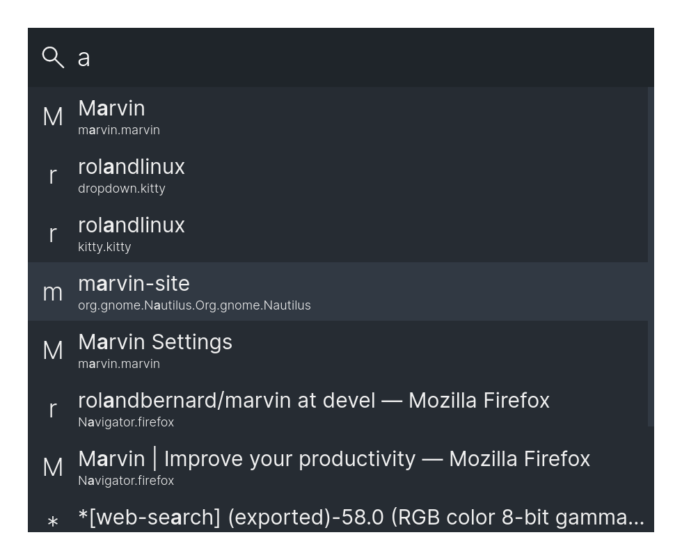

Marvin
======

This is a keystroke launcher for Linux and Windows.


## Table of contents

- [Installation](#installation)
- [Settings](#settings)
- [Features](#features)
- [Themes](#themes)
- [Development](#development)
- [Release notes](https://github.com/rolandbernard/marvin/releases)


## Installation

You can download the latest release of Marvin [here](https://github.com/rolandbernard/marvin/releases/latest).
For both Linux and Windows, portable versions are available in `marvin-*.*.*.zip` and
`Marvin-*.*.*-win.zip` respectively.

### Windows

For Windows, you can download and execute the installer called `Marvin-Setup-*.*.*.exe` from
[here](https://github.com/rolandbernard/marvin/releases/tag/latest). Because the executable is not
signed by Microsoft, Windows will most likely warn you before starting the installer.

### Linux

For Linux, you can download the AppImage. For an easy installation, you can execute the following
command:
```
wget -qO- https://raw.githubusercontent.com/rolandbernard/marvin/master/install.sh | bash
```

If you prefer, you can change the build configuration in `electron-builder.yml` and build a
different package type ([electron-builder docs](https://www.electron.build/configuration/linux)).


## Updates

You can go to the `Update` tab in the settings to check the currently installed version. Use the
`Check for update` button to check for a newer version. To open the latest release in the browser,
use the `Open in browser` button.

If a newer version is available, the `Install update` button will be enabled, and you can press it to
directly install the update and restart the application. When enabling the `Automatic update`
setting, the updates will be downloaded automatically and installed when closing the application.

The direct update features can work on Linux depending on your setup, but it is not very reliable.
If you used the installation script, it should work as expected.


## Settings

With the global shortcut (Alt+Space by default, but can be changed) you can open the main program.

The settings can be opened by searching for 'Settings' (or 'Einstellungen'/'Impostazioni') in the
main window. Settings can also be opened using the tray icons context menu.
The settings include general settings, theme settings and settings specific to certain modules.


## Features

The program uses different modules to provide different functionalities.

### Alias

This module allows you to add an alias for a certain option, that allows you to search it under a different name.


### Applications

This module allows you to start applications.



### Bookmarks

This module allows you to search through your Firefox, Midori and Chromium/Google Chrome bookmarks.



### Calculator

This module allows you to do calculations using Math.js (and/or Algebrite).


### Clipboard

This module allows you to access your clipboard history.



### Color

This module allows you to convert colors between hex/rgb/hsl/hsv.


### Command

This module allows you to execute shell commands.


### Currency converter

This module allows you to quickly convert between currencies.



### Dictionary

This module allows you to quickly lookup definitions and synonyms for words.



### DuckDuckGo Instant Answer

This module gives you the DuckDuckGo Instant Answers for your query.



### Email

This module allows one to quickly start writing a new email.


### Folders

This module allows you to browse files.


### History

This module allows you to execute recent options again.


### HTML

This module allows you to create custom HTML entries.



### Locate (Linux only)

This module allows you to search for files using locate.


### Scripts

This module allows you to create custom entries to execute shell scripts.

### Shortcuts

This module allows you to define shortcuts to run shell scripts.

### System commands

This module will give you access to some fundamental system operations. (Reboot, Shutdown)



### Translate

This module allows you to translate words.


### URL module

This module allows you to open urls.


### Web search

This module allows you to quickly do a web search. It will open a URL, by inserting the query at a specific location.



### Windows

This module allows you to find open windows.




## Themes

There are some predefined themes, but it is also possible to configure most of the colors and
some other parameters in the settings under the 'Theme' tab.


## Development

### Setup

```
git clone https://github.com/rolandbernard/marvin
cd marvin
yarn install
```

### Run

```
yarn debug
```

### Debug

To debug connect to the devtools on port `9223` for the renderer and `9222` for the node.
This only works when running with yarn start and not in the packaged application.

### Build

```
yarn build
```

The output can be found in the `build` directory. If the `NODE_ENV` variable is not set to
`production` a development build will be generated.

