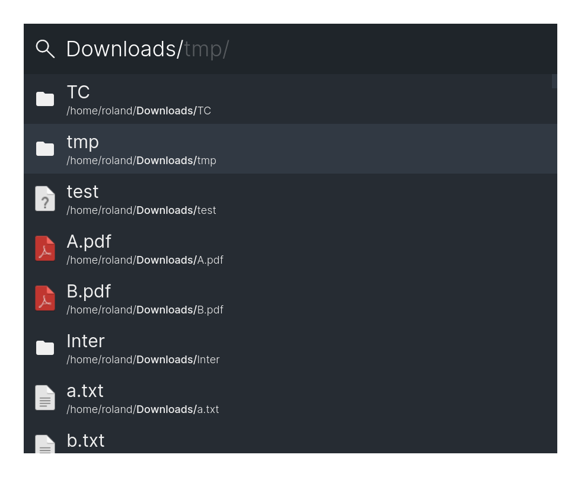
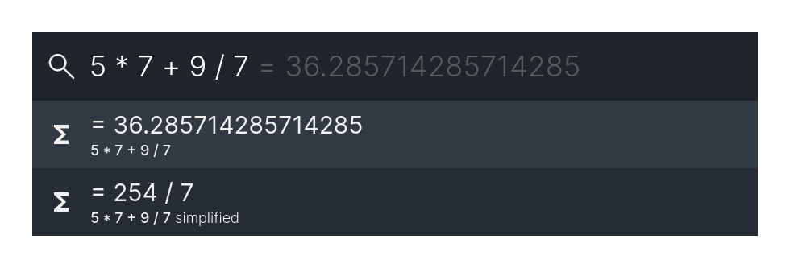
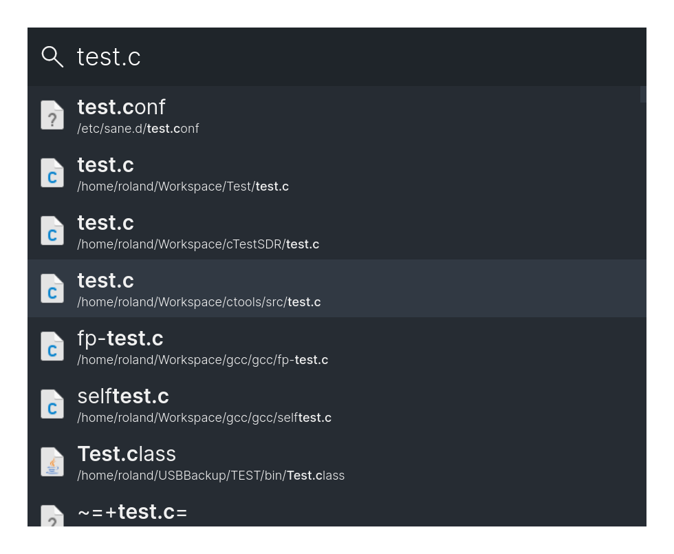
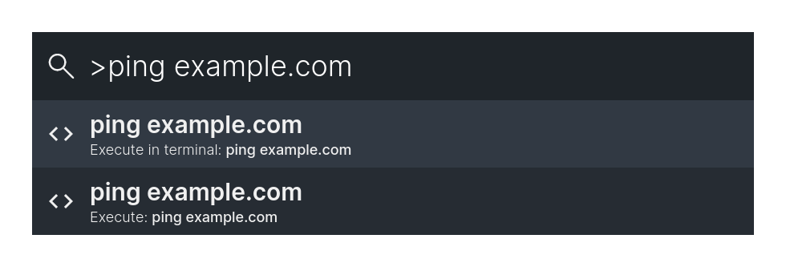

 Marvin
===
This is a keystroke launcher for Linux. It is build using electron but it has not been ported to Windows or MacOs yet.

## Instalation
At this point the only way to install this application, is to install it from source.
To do that, you can execute the following commands.
```
$ cd /tmp
$ git clone https://github.com/rolandbernard/marvin
$ cd marvin
$ yarn dist
$ sudo cp ./dist/Marvin-*.AppImage /usr/bin/marvin
```

## Features
With the global shortcut (Super+D by default, but can be changed) you can open the main program.
The program uses different modules to provide different functionalities.

### Modules

#### Linux system
This module will give you access to some fundamental linux system operations. (Reboot, Shutdown)


#### Folders
This module allows you to browse files.



#### HTML
This module allows you to create custom HTML entries.


#### Calculator
This module allows you to do calculations using mathjs.



#### Linux applications
This module allows you to start applications on linux.


#### URL module
This module allows you to open urls.


#### Locate
This module allows you to search for files using locate.



#### Shortcuts
This module allows you to define shortcuts to run shell scripts.

#### Command
This module allows you to execute shell commands.



#### Scripts
This module allows you to create custom entries to execute shell scripts.

#### Clipboard
This module allows you to access your clipboard history.


#### Deepl
This module allows you to translate text by using Deepl in a headless window.


#### Linux windows
This module allows you to find open windows.


#### Google Translate
This module allows you to translate text by using Google Translate in a headless window.


#### DuckDuckGo Instant Answer
This module gives you the DuckDuckGo Instant Answers for your query.


#### History
This module allows you to execute recent options again.


