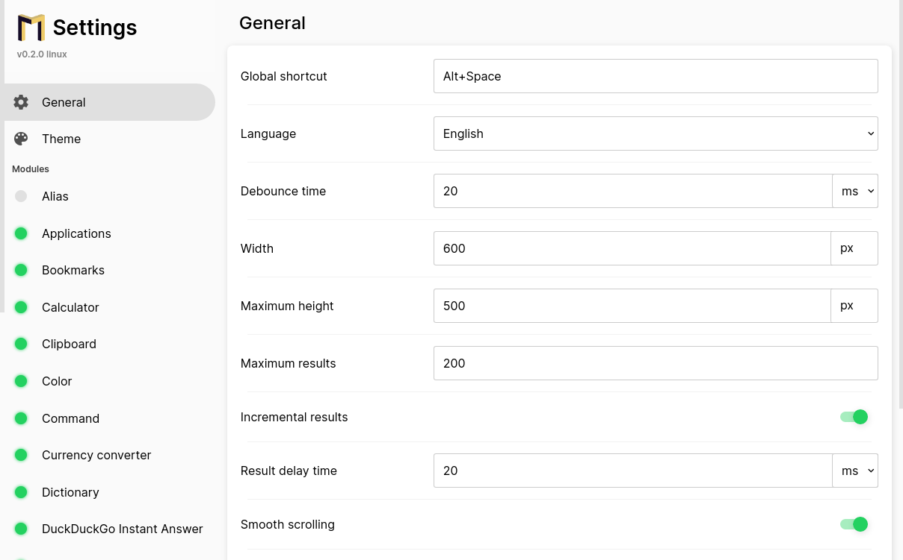
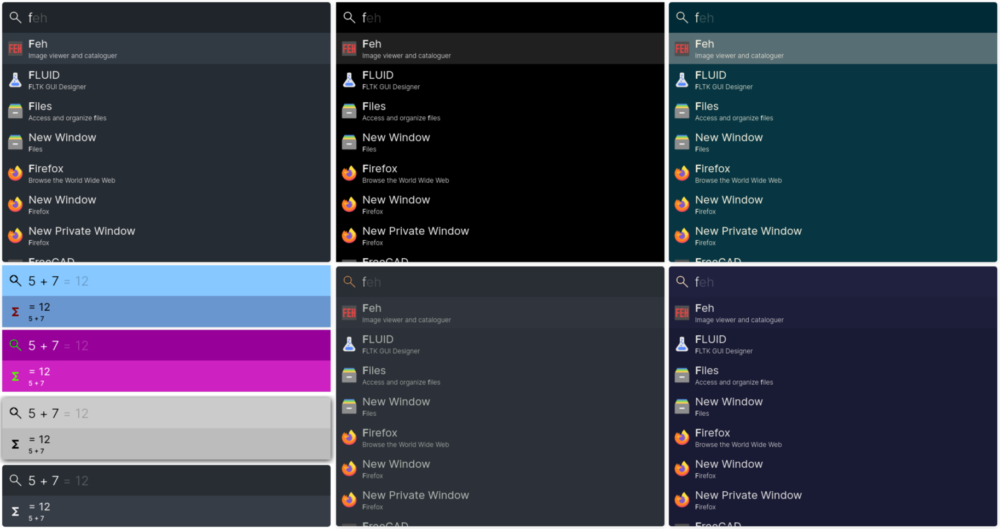
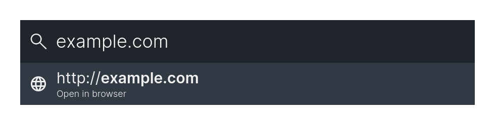
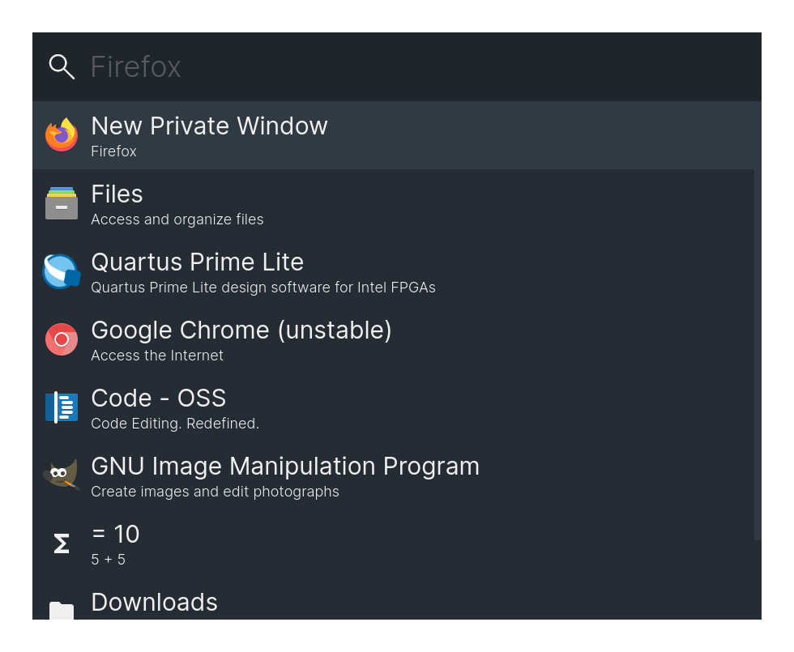
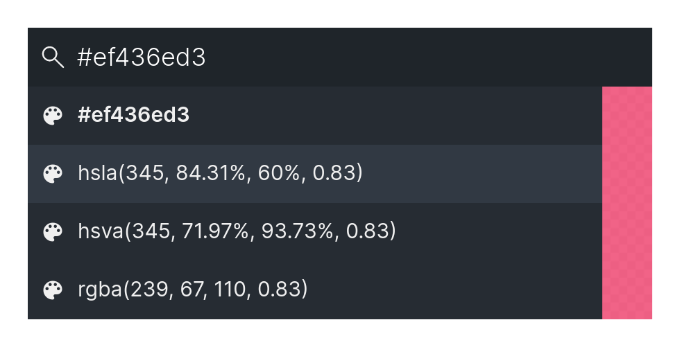
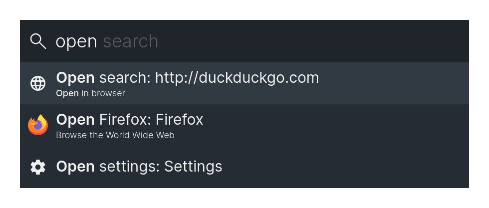

 Marvin
===
This is a keystroke launcher for Linux. It is build using electron but it has not been ported to Windows or MacOs yet.

## Installation
### Using a release AppImage
Download the `Marvin-*.AppImage` file for the newest release here: https://github.com/rolandbernard/marvin/releases
and copy it to a directory in your `PATH` variable (e.g. using `$ sudo cp Marvin-*.AppImage /usr/bin/marvin`).

### From source
To install from source, you can execute the following commands.
```
$ cd /tmp
$ git clone https://github.com/rolandbernard/marvin
$ cd marvin
$ yarn install
$ yarn dist
$ sudo cp ./dist/Marvin-*.AppImage /usr/bin/marvin
```

## Features
With the global shortcut (Super+D by default, but can be changed) you can open the main program.

### Settings
The settings can be opened by searching for 'Settings' (or 'Einstellungen'/'Impostazioni') in
the main window. The settings include general settings, theme settings and settings specific
to certain modules.



### Themes
There are currently no predefined themes, but it is possible to configure most of the colors and
some other parameters in the settings under the 'Theme' tab.



### Modules
The program uses different modules to provide different functionalities.

#### Linux system
This module will give you access to some fundamental linux system operations. (Reboot, Shutdown)


#### Folders
This module allows you to browse files.


#### HTML
This module allows you to create custom HTML entries.


#### Calculator
This module allows you to do calculations using Math.js or Algebrite.


#### Linux applications
This module allows you to start applications on linux.


#### URL module
This module allows you to open urls.



#### Locate
This module allows you to search for files using locate.


#### Shortcuts
This module allows you to define shortcuts to run shell scripts.

#### Command
This module allows you to execute shell commands.


#### Scripts
This module allows you to create custom entries to execute shell scripts.

#### Clipboard
This module allows you to access your clipboard history.


#### Deepl
This module allows you to translate text by using Deepl in a headless window.


#### Linux windows
This module allows you to find open windows.


#### Google Translate
This module allows you to translate text by using Google Translate in a headless window.


#### DuckDuckGo Instant Answer
This module gives you the DuckDuckGo Instant Answers for your query.


#### History
This module allows you to execute recent options again.



#### Color
This module allows you to convert colors between hex/rgb/hsl.



#### Web search
This module allows you to quicky do a web search. It will open a URL, by inserting the query at a specific location.


#### Alias
This module allows you to add an alias for a certail option, that allows you to search it under a different name.



#### Currency converter
This module allows you to quickly convert between currencies.


#### Dictionary
This module allows you to quickly lookup definitions and synonyms for words.


#### Bookmarks
This module allows you to search through your Firefox, Midori and Chromium/Google Chrome bookmarks.


#### Email
This module allows one to quickly start writing a new email.


